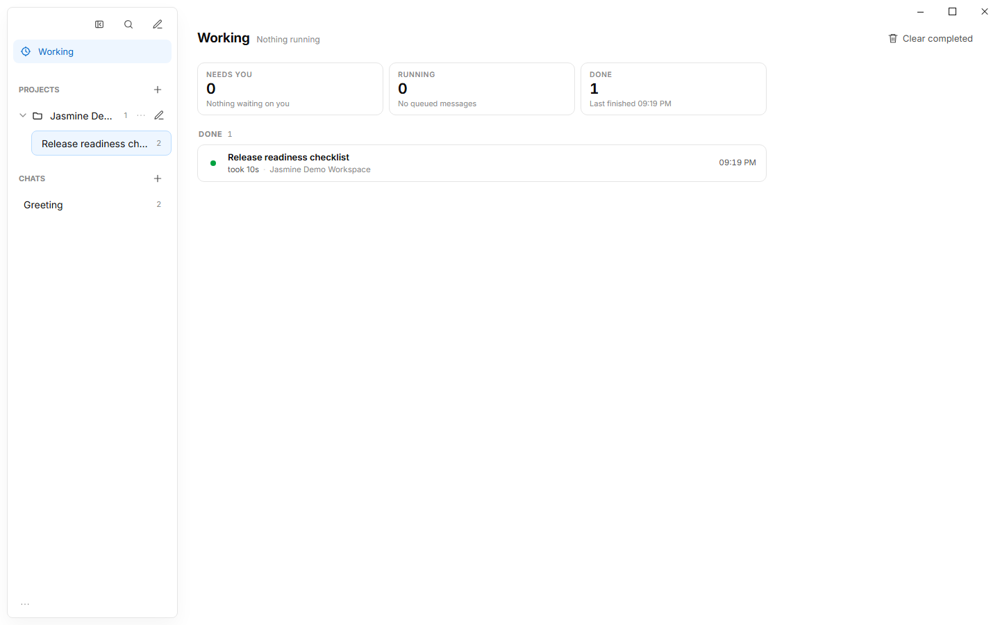
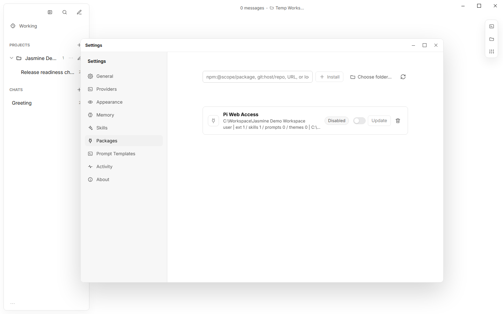

# Jasmine

### Pi 的桌面应用

[English](README.md) | 简体中文

Jasmine 是一个独立、开源的 Pi 编码智能体桌面 GUI，把 Pi 兼容会话、终端工作流、技能、扩展和智能体交互带进一个现代桌面应用。

> Jasmine 是社区构建的项目，与 Pi 官方没有关联，也未获得其背书。


## 功能

- **Pi 会话** —— 以 Pi 兼容的 JSONL 作为对话的权威记录，同时提供持久化的本地会话列表、草稿、项目、搜索和会话导入。
- **Pi 的桌面 GUI** —— 在桌面应用内使用富文本对话、附件、Working 任务、记忆、活动记录和项目上下文。
- **Pi 技能与扩展** —— 使用可复用的技能、提示词模板和 Pi 包，联网能力由 `pi-web-access` 包提供。
- **内置终端** —— 在与编码智能体对话的同时运行项目终端。
- **快速的文件变更产物** —— 查看受管 `write/edit` 目标的统一文本 diff 和前后图片快照，也可以选择基于事件的文件系统监听模式，在不遍历工作区的前提下覆盖更多 shell 行为。
- **灵活的模型** —— 接入多个 OpenAI 兼容供应商，支持模型发现和按模型配置。

Jasmine 把应用数据保存在本地，但配置好的 AI 供应商，以及你启用的任何 Pi 包（包括联网访问）都可能把数据发送到本机之外。启用每一项集成前请先自行评估。

Pi 兼容的 JSONL 是模型对话的权威记录；SQLite 只是事务性投影，服务于会话列表、搜索、界面分页、设置、追踪，以及回链到 JSONL 条目 ID。参见[会话存储](docs/session_storage.md)与 [Pi 会话导入](docs/pi_session_import.md)。

## 上下文检查

Jasmine 把每一次模型请求都呈现为可读的上下文分类。最新的用户任务在持久化后立即出现，并按线路顺序展示每个供应商子请求（`1/N`），包含文本、推理、工具调用与结果、供应商选项、显式的未分类字段、载荷结构、真实用量、估算构成，以及 DeepSeek/Kimi 的推理保留校验。脱敏后的原始载荷以 gzip 存储，只有展开时才加载。


上面的例子使用了两次真实的模型往返，并展开了捕获到的对话上下文与供应商请求。哪些历史思考块必须重放，取决于 DeepSeek 与 Kimi 各自的规则，详见[推理上下文保留](docs/reasoning_context_retention.md)。

## 文件变更产物

Jasmine 通过宿主工厂使用独立的 [`@jasmine-ai/pi-file-changes`](src/main/agent/extensions/fileChanges/README.md) 包。默认的 `managed-tools-only` 模式只捕获被批准执行的 `write/edit` 的确切目标，不会遍历项目，因此无关的大文件不会拖慢对话。可选的 watcher 模式监听原生文件系统事件，从而覆盖更多 Bash 行为，但会明确说明变更前内容和因果归因无法保证。两种模式都不解析 shell 命令，也不猜测重命名。

Artifacts 面板把每次捕获保存为运行级别的观测账本，并在存在对应修订时按需打开 GitHub 风格的统一文本 diff 或有大小上限的前后图片快照。编辑或重试对话消息不会抹掉更早的捕获，因为这些操作同样不会回滚文件系统。被敏感路径或高置信内容规则命中的文件会保留路径、状态、哈希、大小和权限位，但预览字节与 diff 会被脱敏。失败的运行会保留已经捕获到的证据。

## 产品导览

<details>
<summary>工作区、本地上下文与项目工具</summary>

| Working | 搜索 |
| --- | --- |
|  |  |
| 记忆 | 活动 |
|  |  |
| Artifacts | 终端 |
|  |  |

</details>

<details>
<summary>设置与集成</summary>

| 通用 | 供应商 |
| --- | --- |
|  |  |
| 外观 | 记忆 |
|  |  |
| 技能 | 包 |
|  |  |
| 提示词模板 | |
|  | |
| 活动 | 联网搜索 |
|  |  |
| 关于 | |
|  | |

</details>

## 安装

从 [GitHub Releases](https://github.com/ArtificialNotImbecile/pi-desktop/releases/latest) 下载对应平台的安装包，并用随发布提供的 `SHA256SUMS.txt` 校验。

- **Windows x64：** 使用 `Jasmine-Setup-<version>-x64.exe`。安装包没有代码签名，Windows 可能弹出 SmartScreen 提示。
- **Linux x64：** 便携运行使用 `Jasmine-<version>-linux-x86_64.AppImage`，Debian 系发行版使用 `Jasmine-<version>-linux-amd64.deb`。AppImage 首次启动前可能需要 `chmod +x`。
- **Apple Silicon macOS：** 使用 `Jasmine-<version>-mac-arm64.dmg`。

macOS 构建使用 ad-hoc 签名且未经过公证。信任该应用的用户可能需要先尝试打开一次，然后在**系统设置 → 隐私与安全性 → 仍要打开**中放行。受管控的 Mac 可能禁止这一操作。

### 软件更新

**设置 → 关于**会在所有已安装平台上检查 GitHub Releases，但之后能做什么取决于该平台如何安装更新：

| 平台 | 检查更新 | 下载并原地安装 |
| --- | --- | --- |
| Windows（NSIS 安装包） | 支持 | 支持 |
| Linux（AppImage、deb） | 支持 | 支持 |
| macOS | 支持 | 不支持 —— 改为打开下载页面 |

macOS 是例外，因为 Squirrel.Mac 会用正在运行的应用的指定代码签名要求去校验下载到的包。Jasmine 的 ad-hoc 签名把这个要求钉死在某一次构建的 `cdhash` 上，于是之后的每个版本都会以 `SQRLCodeSignatureErrorDomain` 被拒绝。唯一的解决办法是用 Developer ID 身份签名 macOS 构建；应用会在启动时检测到正确签名的包，并自动切换到原地安装，无需其他改动。

在 AppImage 之外启动的 Linux 构建同样无法自我替换，此时更新会如实报告为不支持，而不是给出一个点了也没用的按钮。

## 本地开发环境要求

- Node.js 22
- npm

## 本地运行

```powershell
git clone https://github.com/ArtificialNotImbecile/pi-desktop.git
cd pi-desktop
npm.cmd ci
npm.cmd run build
npm.cmd start
```

开发模式：

```powershell
npm.cmd run dev
```

Electron 把 Jasmine 的数据存放在操作系统的应用数据目录中。测试使用隔离的临时用户数据目录，不会复用正常使用的配置。

## 供应商凭据

推荐使用环境变量引用来配置凭据。例如把供应商的密钥配置为 `env:DEEPSEEK_API_KEY`，并在启动 Jasmine 前于操作系统中设置该变量。

Jasmine 也支持直接填写密钥。直接填写的密钥会以明文保存在本地 SQLite 数据库中：它们在渲染进程可见的设置界面里会被遮蔽，但并不受操作系统凭据保管库保护。请不要在不可信或共用的电脑上使用直接保存。

## 路线图

远程 SSH 开发、Chrome 浏览器控制、MCP 服务器等能力会先作为独立的 Pi 扩展/包开发和验证，成熟后再接入桌面应用。计划与验收标准见[路线图](docs/roadmap.md)。

## 测试

常用检查：

```powershell
npm.cmd run build
npm.cmd run test:unit
npm.cmd run harness:check
npm.cmd run test:e2e:smoke
```

运行 `npm.cmd run test:e2e` 可在后台/离屏模式下执行完整的 Electron 套件：测试窗口保持透明、不可聚焦且不出现在任务栏；只有在需要有意的前台调试时才使用 `npm.cmd run test:e2e:headed`。完整的本地发布门禁是 `npm.cmd run harness:release`，其最后的验收阶段有意运行在前台。生成的截图、trace、审计和验收结果都写入被 Git 忽略的 `test-results/` 路径。

用 `npm.cmd run readme:capture` 重新生成 README 截图和真实模型的上下文分类 GIF，该命令会使用 `DEEPSEEK_API_KEY` 发起两次真实请求。用 `npm.cmd run dist:win` 构建 Windows 安装包，并用 `npm.cmd run test:packaged` 验证解包后的应用。Linux 和 macOS 的安装包在发布时于对应的 GitHub Actions 原生运行器上构建与冒烟测试。

测试地图与验证策略见 [docs/harness.md](docs/harness.md)。

## 文档

从 [Jasmine 文档](docs/README.md)开始，了解 Pi 会话行为、存储、推理上下文和桌面开发工作流。维护者在发布版本前应先阅读[开发与发版指南](docs/development-and-release.md)。

## 贡献与安全

提交改动前请阅读 [CONTRIBUTING.md](CONTRIBUTING.md)。安全问题请通过 GitHub 的私密漏洞报告流程反馈，详见 [SECURITY.md](SECURITY.md)。

## 许可证

Jasmine 使用 [MIT 许可证](LICENSE)。
