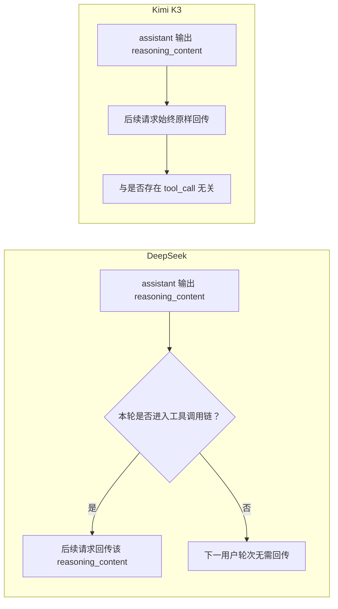

# 推理上下文回传策略

本文记录 OpenAI-compatible thinking 模型在后续请求中如何处理 `reasoning_content`。这里讨论的是发送给模型的 provider payload，不是 Jasmine 是否应在界面或规范会话记录中保存思考内容。

- 适用范围：DeepSeek V4、Moonshot Kimi K2.5/K2.6/K2.7 Code/K3
- 最后核对：2026-08-09
- 事实来源：供应商官方文档，链接见文末

## 结论

DeepSeek 与 Kimi K3 的关键差异是：

- **DeepSeek** 的历史思考主要按工具调用链保留。两个 `user` 消息之间没有发生工具调用时，中间 assistant 的 `reasoning_content` 不需要进入下一用户轮次；发生工具调用时则必须回传。
- **Kimi K3** 始终启用 Preserved Thinking。历史 assistant 的 `reasoning_content` 是否需要回传，不取决于它后面有没有 `tool_call`；多轮对话和工具调用中都必须原样回传完整 assistant message。

因此，不能把“只回传带 `tool_call` 的 reasoning”作为所有 provider 的统一规则。



## 先区分两个边界

理解 Kimi 文档时，必须把下面两个边界分开：

1. **同一用户任务内的工具循环**：模型输出思考和工具调用，应用执行工具，再携带工具结果请求模型继续推理。
2. **跨用户轮次**：工具循环已经结束，模型已经给出最终回答，用户又发送了一个新问题。

Kimi 对第一个边界和第二个边界使用不同规则。仅观察 thinking 后面是否存在 `tool_call`，无法表达完整语义。

## Provider 与模型规则

| Provider / 模型 | 同一工具循环内 | 进入下一用户轮次 | 配置方式 |
| --- | --- | --- | --- |
| DeepSeek thinking 模式 | 工具调用关联的 `reasoning_content` 必须回传 | 没有工具调用的普通思考无需回传；工具调用链中的思考必须保留 | `thinking.type` / `reasoning_effort` |
| Kimi K3 | 回传全部历史 assistant message，包括 `reasoning_content` | 回传全部历史 `reasoning_content` | Preserved Thinking 始终开启；不接受 `thinking` 参数 |
| Kimi K2.7 Code / Highspeed | 回传全部历史 assistant message，包括 `reasoning_content` | 回传全部历史 `reasoning_content` | Preserved Thinking 始终开启；`thinking.keep` 无法关闭 |
| Kimi K2.6，默认 | 当前工具循环的全部中间思考必须回传 | 忽略全部历史 `reasoning_content`，包括曾与工具调用关联的思考 | `thinking.keep=null` 或不传 |
| Kimi K2.6，保留模式 | 当前工具循环的全部中间思考必须回传 | 回传全部历史 `reasoning_content`，包括最终回答前、后面没有 `tool_call` 的思考 | `thinking.keep="all"` |
| Kimi K2.5 | 按当前请求产生思考 | 不支持 Preserved Thinking | 无 `thinking.keep` |

### DeepSeek 的严格工具模式边界

DeepSeek 文档同时给出一条更严格的工程约束：携带 `tools` 参数的请求，在后续请求中必须完整回传 `reasoning_content`；缺失时 API 可能返回 `400`。因此实现时应把**已经进入 tool-enabled 请求流程**视为严格保留区域，而不是尝试在工具循环中做更细粒度裁剪。

这不改变普通多轮对话的结论：如果两个 `user` 消息之间没有工具调用，上一轮普通回答的 `reasoning_content` 不需要拼接到下一用户轮次。

### Kimi K3 的完整回传

Kimi K3 的 Preserved Thinking 始终开启。下面两种 assistant 消息中的 `reasoning_content` 都必须进入后续请求：

```text
reasoning_content -> tool_calls
reasoning_content -> content（最终回答）
```

第二种正是它与 DeepSeek 简化回传规则的核心差异。

## 对 Jasmine Context Taxonomy 的含义

Context Taxonomy 应区分三个事实，不应把它们折叠成一个“是否保留”状态：

1. **Recorded**：这段 thinking 是否存在于 Pi JSONL 规范会话记录中。
2. **Eligible**：按照当前 provider、模型、工具循环边界和配置，这段 thinking 是否应进入下一次请求。
3. **Sent**：最终 provider payload 是否实际携带了对应 `reasoning_content`。

规范会话记录应保留模型真实输出；provider payload 的回传策略应在请求投影阶段决定。这样可以在切换模型、重试、分支和导入 Pi session 时保留完整证据，同时避免把 DeepSeek 的裁剪规则错误应用到 Kimi K3。

建议把回传策略至少建模为以下两个维度：

```text
currentToolLoop: preserve_all
crossUserTurn: tool_chain | preserve_all | discard_all
```

对应关系：

| 模型 / 配置 | `currentToolLoop` | `crossUserTurn` |
| --- | --- | --- |
| DeepSeek | `preserve_all` | `tool_chain` |
| Kimi K3 | `preserve_all` | `preserve_all` |
| Kimi K2.7 Code | `preserve_all` | `preserve_all` |
| Kimi K2.6 `keep=null` | `preserve_all` | `discard_all` |
| Kimi K2.6 `keep=all` | `preserve_all` | `preserve_all` |

## 回归验证要求

Provider adapter 或 Pi 依赖升级后，至少验证以下 payload：

1. DeepSeek：`reasoning_content -> content`，下一用户轮次不携带历史 reasoning。
2. DeepSeek：`reasoning_content -> tool_calls -> tool result`，后续工具请求携带原始 reasoning。
3. Kimi K3：`reasoning_content -> content`，下一用户轮次仍携带原始 reasoning。
4. Kimi K3：多步工具循环中的每段 reasoning 和最终回答前的 reasoning 都进入下一用户轮次。
5. Kimi K2.6 默认：同一工具循环保留 reasoning，下一用户轮次忽略全部历史 reasoning。
6. Kimi K2.6 `keep="all"`：下一用户轮次携带全部历史 reasoning。

断言应检查实际发往 provider 的 `messages`，不能只检查 Jasmine UI 或 Pi JSONL，因为“已保存”不等于“已发送”。

## 官方资料

- [DeepSeek：思考模式](https://api-docs.deepseek.com/zh-cn/guides/thinking_mode/)
- [Kimi：思考模型](https://platform.kimi.com/docs/guide/use-thinking-models)

